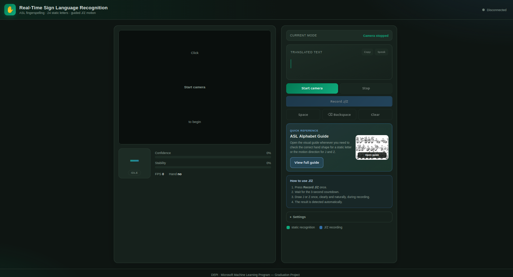

# Real-Time ASL Fingerspelling Recognition

<p align="center">
  
</p>

<p align="center">
  <strong>24 static letters + dynamic J and Z · Real-time webcam inference · Live text builder</strong>
</p>

<p align="center">
  <a href="https://github.com/Ahmed7610/real-time-asl-recognition">GitHub Repository</a>
  ·
  <a href="https://www.linkedin.com/in/eng-ahmed-hassan-ah6100/">LinkedIn</a>
</p>

---

## Overview

This project is a live web application that translates American Sign Language
(ASL) fingerspelling gestures into text in real time.

The webcam stream is processed with MediaPipe to extract 21 hand landmarks.
Twenty-four static letters are recognized continuously, while the motion-based
letters **J** and **Z** are handled by dedicated sequence models through a guided
one-click recording workflow.

The application includes:

- Real-time webcam recognition.
- Recognition of all 26 ASL fingerspelling letters.
- Continuous recognition for 24 static letters.
- Dedicated dynamic sequence models for J and Z.
- Temporal smoothing and confidence filtering.
- Live text construction with Space, Backspace, and Clear.
- Copy and text-to-speech actions.
- Built-in ASL alphabet visual reference.
- FastAPI REST and WebSocket backend.
- Responsive browser interface.

> This project recognizes ASL fingerspelling letters. It is not a complete
> sign-language sentence or grammar translator.

---

## Live Demo

The deployed application:

```text
https://real-time-asl-recognition.onrender.com/
```

---

## Application Workflow

### Static letters

1. Start the camera.
2. Show one of the 24 static ASL letters.
3. Hold the hand pose briefly.
4. The recognized letter is added to the translated text.
5. Release or change the pose before repeating the same letter.

### Dynamic J and Z

1. Press **Record J/Z** once.
2. Wait for the `3 → 2 → 1` countdown.
3. Draw J or Z during the recording window.
4. Recording stops automatically.
5. The result and confidence are displayed.
6. The application returns automatically to static recognition.

---

## System Architecture

```text
Browser Webcam
      │
      ▼
Mirrored JPEG Frames over WebSocket
      │
      ▼
FastAPI Backend
      │
      ▼
MediaPipe Hand Landmarker
      │
      ├── Static mode
      │     21 landmarks → normalization → StandardScaler
      │     → Static MLP → smoothing → text builder
      │
      └── Dynamic mode
            landmark sequence → motion trimming → 40-frame resampling
            → velocity / fingertip motion features
            → J model + Z model → pose/path validation
            → detected J or Z
```

---

## Models

### Static model

- Classes: `A B C D E F G H I K L M N O P Q R S T U V W X Y`
- Input: 21 hand landmarks × `(x, y, z)` = 63 values.
- Preprocessing:
  - Wrist-relative landmark normalization.
  - Scale normalization.
  - StandardScaler transformation.
- Classifier: TensorFlow/Keras multilayer perceptron.
- Runtime stabilization:
  - Confidence threshold.
  - Temporal majority smoothing.
  - Hold-to-commit text logic.

### Dynamic models

- Separate sequence models for **J** and **Z**.
- Each sequence is:
  - Motion-trimmed.
  - Resampled to 40 frames.
  - Extended with velocity and fingertip motion features.
- J focuses on pinky motion and J hand-pose validation.
- Z focuses on index-finger motion and Z hand-pose validation.

---

## Technology Stack

| Layer | Technologies |
|---|---|
| Machine Learning | Python, TensorFlow/Keras, scikit-learn, NumPy |
| Hand Tracking | MediaPipe Hand Landmarker |
| Backend | FastAPI, Uvicorn, OpenCV, WebSocket |
| Frontend | HTML, CSS, Vanilla JavaScript, Canvas API |
| Browser Features | Webcam API, Clipboard API, Web Speech API |
| Deployment | GitHub, Hugging Face Spaces |

---

## Repository Structure

```text
.
├── backend/
│   ├── app.py
│   ├── requirements.txt
│   ├── Dockerfile
│   ├── run.sh
│   └── run.bat
│
├── frontend/
│   ├── index.html
│   ├── styles.css
│   ├── app.js
│   └── asl_alphabet_guide.png
│
├── Real-Time Sign Language Recognition/
│   ├── StaticModel.keras
│   ├── StaticScaler.pkl
│   ├── StaticLabelEncoder.pkl
│   ├── DynamicJModel_clean.keras
│   ├── DynamicZModel_trimmed.keras
│   ├── asl_inference.py
│   ├── asl_landmarks.py
│   ├── hand_landmarker.task
│   ├── config.json
│   └── class_mapping.json
│
├── training/
├── demo/
├── docs/
├── presentation/
├── LICENSE
├── .gitignore
└── README.md
```

---

## Local Installation

### Requirements

- Python 3.10–3.12
- Webcam
- Modern browser with webcam support
- Linux, Windows, or macOS

### 1. Clone

```bash
git clone https://github.com/Ahmed7610/real-time-asl-recognition.git
cd real-time-asl-recognition
```

### 2. Create a virtual environment

Linux/macOS:

```bash
python3 -m venv .venv
source .venv/bin/activate
```

Windows:

```powershell
python -m venv .venv
.venv\Scripts\activate
```

### 3. Install dependencies

```bash
pip install --upgrade pip
pip install -r backend/requirements.txt
```

### 4. Start the backend

Run from the repository root:

```bash
uvicorn backend.app:app --host 0.0.0.0 --port 8000
```

Health check:

```text
http://127.0.0.1:8000/health
```

API documentation:

```text
http://127.0.0.1:8000/docs
```

### 5. Start the frontend

In a second terminal:

```bash
cd frontend
python3 -m http.server 5500
```

Open:

```text
http://127.0.0.1:5500
```

---

## API Summary

| Method | Endpoint | Description |
|---|---|---|
| `GET` | `/health` | Backend and model status |
| `GET` | `/config` | Classes and inference configuration |
| `POST` | `/predict` | Predict from a base64 image |
| `POST` | `/predict/file` | Predict from an uploaded image |
| `POST` | `/predict/landmarks` | Predict from 21 × 3 landmarks |
| `POST` | `/word/edit` | Space, Backspace, or Clear |
| `POST` | `/reset` | Reset a browser session |
| `WS` | `/ws` | Live streaming and prediction |

Dynamic WebSocket controls:

```json
{ "type": "dynamic_start" }
```

```json
{ "type": "dynamic_stop" }
```

---

## Project Contributions

This repository is a continued and expanded version of the DEPI graduation
project.

- **Ahmed Salama**
  - Developed the original static ASL recognition foundation.
- **Ahmed Hassan**
  - Improved and integrated the static recognition pipeline.
  - Designed and trained the dynamic J and Z recognition workflow.
  - Implemented sequence preprocessing and motion features.
  - Built the FastAPI and WebSocket backend.
  - Built and redesigned the live browser application.
  - Added guided dynamic recording, text builder, speech, copy controls,
    and the integrated ASL guide.
  - Prepared the deployment workflow.

### Original DEPI Team

- Ahmed Salama — Team Leader
- Ahmed Hassan
- Yara Ahmed
- Salwa Elkordy
- Supervisor: Alaa Samir

---

## Screenshots

Place project images in:

```text
docs/images/
```

Recommended filenames:

```text
docs/images/web-app-preview.png
docs/images/dynamic-recording.png
docs/images/asl-reference-guide.png
```

The main screenshot is already referenced at the top of this README.

---

## Limitations

- Recognition quality depends on lighting, camera quality, hand visibility,
  and similarity to the training data.
- The current system is designed primarily for one visible hand.
- J and Z require a short guided recording sequence.
- Fingerspelling recognition does not cover full ASL words, grammar,
  facial expressions, or body gestures.
- Dynamic accuracy may vary between users and motion speeds.

---

## Future Improvements

- Automatic motion start and stop detection.
- Larger multi-user dynamic dataset.
- Mobile performance optimization.
- Full-word and continuous sign recognition.
- Model quantization and faster inference.
- Additional accessibility and language features.

---

## Author

**Ahmed Hassan**

- Email: `engahmedhassan309@gmail.com`
- LinkedIn: https://www.linkedin.com/in/eng-ahmed-hassan-ah6100/
- GitHub: https://github.com/Ahmed7610
- Hugging Face: https://huggingface.co/Ahmed6100

---

## License

This project is licensed under the MIT License. See [LICENSE](LICENSE).
